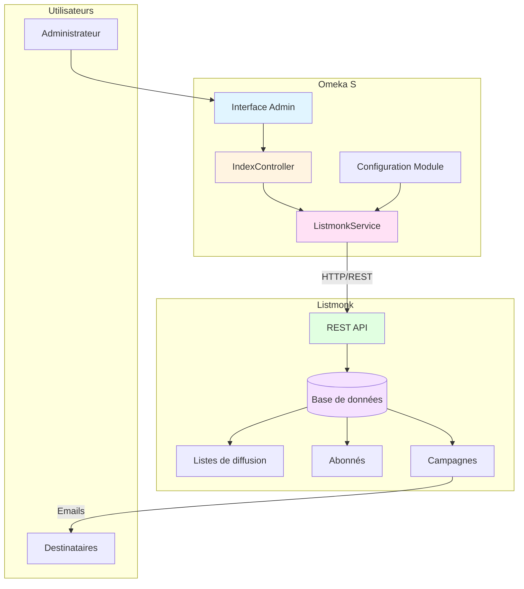
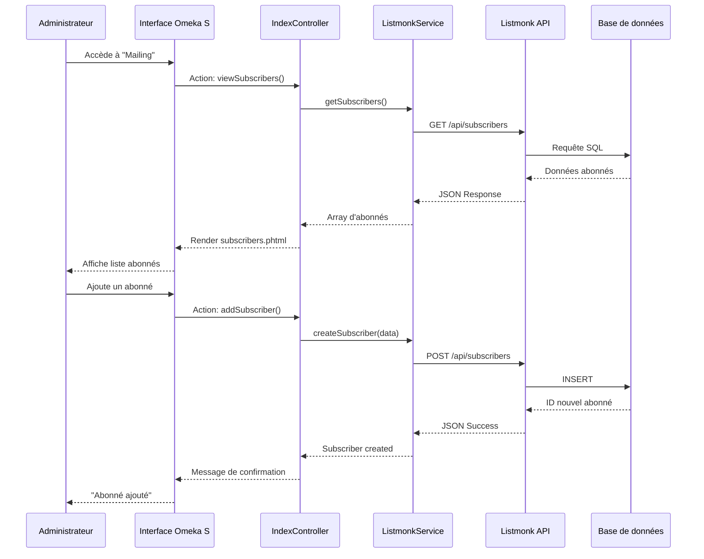
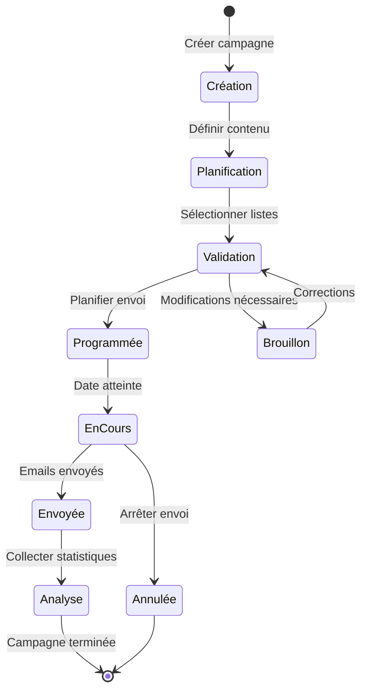

# Omeka S Mailing Module

An Omeka S module for managing mailing lists and campaigns using [Listmonk](https://listmonk.app/).

## Description

This module integrates Listmonk, a self-hosted newsletter and mailing list manager, with Omeka S. It allows you to:

- Manage subscribers from within Omeka S
- View and manage mailing lists
- Monitor email campaigns
- Configure Listmonk API connection

## Architecture

### Composants du système



### Flux de gestion des abonnés



### Flux de campagne email



## Features

- **Subscriber Management**: View all subscribers synced with your Listmonk instance
- **List Management**: View all mailing lists and their statistics
- **Campaign Monitoring**: Track email campaigns, view stats (opens, clicks)
- **API Integration**: Seamless connection to Listmonk via REST API
- **Configuration Interface**: Easy setup through Omeka S admin interface

## Requirements

- Omeka S version 3.0 or higher
- PHP 7.4 or higher
- A running Listmonk instance with API access
- Listmonk API credentials (username and password)

## Installation

1. Download or clone this repository into your Omeka S `modules` directory:
   ```bash
   cd /path/to/omeka-s/modules
   git clone https://github.com/samszo/Omeka-S-module-Mailing.git Mailing
   ```

2. Log in to your Omeka S admin panel

3. Navigate to **Modules** in the left sidebar

4. Find "Mailing" in the list and click **Install**

5. After installation, click **Configure** to set up your Listmonk connection

## Configuration

1. Go to **Modules** → **Mailing** → **Configure**

2. Enter your Listmonk configuration:
   - **Listmonk URL**: The base URL of your Listmonk installation (e.g., `https://listmonk.example.com`)
   - **Listmonk Username**: Your Listmonk admin username
   - **Listmonk Password**: Your Listmonk admin password
   - **Default List ID**: (Optional) The default mailing list ID to use

3. Click **Submit** to save your settings

## Usage

### Viewing Subscribers

1. Navigate to **Mailing** in the admin sidebar
2. Click **View Subscribers**
3. Browse all subscribers from your Listmonk instance

### Managing Lists

1. Navigate to **Mailing** → **View Lists**
2. See all available mailing lists with subscriber counts and status

### Monitoring Campaigns

1. Navigate to **Mailing** → **View Campaigns**
2. View all email campaigns with statistics (views, clicks, status)

## API Integration

The module uses the Listmonk REST API to communicate with your Listmonk instance. The following endpoints are currently supported:

- `GET /api/lists` - Retrieve all mailing lists
- `GET /api/subscribers` - Retrieve subscribers
- `GET /api/campaigns` - Retrieve campaigns
- `POST /api/subscribers` - Create new subscribers
- `PUT /api/subscribers/:id` - Update subscriber information
- `DELETE /api/subscribers/:id` - Remove subscribers

### Architecture des services

```mermaid
graph LR
    subgraph "Omeka S Module"
        Controller[IndexController]
        Factory[ListmonkServiceFactory]
        Service[ListmonkService]
    end
    
    subgraph "Configuration"
        Settings[Module Settings]
        Credentials[API Credentials]
    end
    
    subgraph "Listmonk API"
        Lists[/api/lists]
        Subscribers[/api/subscribers]
        Campaigns[/api/campaigns]
    end
    
    Controller --> Service
    Factory --> Service
    Settings --> Factory
    Credentials --> Factory
    Service --> |GET/POST/PUT/DELETE| Lists
    Service --> |GET/POST/PUT/DELETE| Subscribers
    Service --> |GET| Campaigns
    
    style Controller fill:#fff4e1
    style Service fill:#ffe1f5
    style Factory fill:#e1f5ff
    style Lists fill:#e1ffe1
    style Subscribers fill:#e1ffe1
    style Campaigns fill:#e1ffe1
```

## Development

### Module Structure

```
Mailing/
├── Module.php                      # Main module class
├── config/
│   ├── module.ini                 # Module metadata
│   └── module.config.php          # Routing and service configuration
├── src/
│   ├── Controller/
│   │   └── Admin/
│   │       └── IndexController.php # Admin interface controller
│   └── Service/
│       ├── ListmonkService.php    # Listmonk API service
│       └── ListmonkServiceFactory.php # Service factory
├── view/
│   └── mailing/
│       └── admin/
│           └── index/
│               ├── index.phtml     # Dashboard view
│               ├── subscribers.phtml # Subscribers list
│               ├── lists.phtml     # Lists view
│               └── campaigns.phtml # Campaigns view
├── asset/
│   ├── css/
│   │   └── mailing.css            # Module styles
│   └── js/
│       └── mailing.js             # Module JavaScript
└── README.md                       # This file
```

## Troubleshooting

### Cannot Connect to Listmonk

- Verify your Listmonk URL is correct and accessible
- Check that your username and password are correct
- Ensure your Listmonk instance is running and the API is accessible
- Check firewall settings if Listmonk is on a different server

### No Data Showing

- Verify your Listmonk instance has data (subscribers, lists, campaigns)
- Check the browser console for any JavaScript errors
- Check Omeka S error logs for PHP errors

## Contributing

Contributions are welcome! Please feel free to submit a Pull Request.

## License

This project is licensed under the terms specified in the LICENSE file.

## Support

For issues, questions, or contributions, please visit:
- **GitHub Issues**: https://github.com/samszo/Omeka-S-module-Mailing/issues

## Credits

Developed by Samuel Szoniecky

## Related Projects

- [Listmonk](https://listmonk.app/) - The newsletter and mailing list manager
- [Omeka S](https://omeka.org/s/) - The web publishing platform
